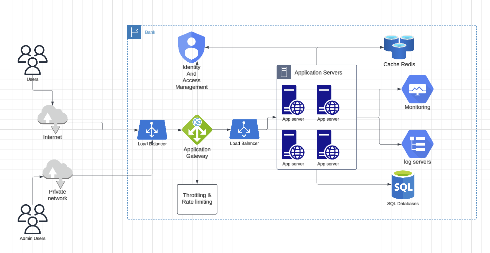

# Mortgage check application 

## System Design Diagram



## Build

```shell
./mvnw clean package
```

with ignoring tests

```shell
mvn clean install -DskipTests
```

Running tests

```shell
./mvnw veryfy
```

## Running App

Running the app in dev profile with test data

```shell
./mvnw spring-boot:run 
```

Running the app with prod profile without test data

```shell
./mvnw spring-boot:run -Dspring.profiles.active=prod
```
as injecting data was not in the scope of the assessment, you can not see any results when you run the project with this profile.

## Docker

### Building docker image:

```shell
./mvnw docker:build
```

### running docker container:

```shell
docker-compose up -d
```

### Stopping the container

```shell
docker-compose down
```

### API documentation

http://localhost:8080/swagger-ui/index.html

## API Calls

### Get All Interest rates

```shell
curl --location --request GET 'http://localhost:8080/api/v1/interest-rates' \
--header 'Content-Type: application/json' \
--data-raw '{
    "income": 80000,
    "maturityPeriod": 144,
    "loanValue": 200000,
    "homeValue": 300000

}'
```

### Mortgage Check

```shell
curl --location --request POST 'http://localhost:8080/api/v1/mortgage-check' \
--header 'Content-Type: application/json' \
--data-raw '{
    "income": 80000,
    "maturityPeriod": 144,
    "loanValue": 200000,
    "homeValue": 300000

}'
```

## Monitoring API

### Management endpoints:

```shell
curl http://localhost:8080/management
```

### Health endpoint:

```shell
curl http://localhost:8080/management/health
```

### Cache management endpoint:

```shell
curl http://localhost:8080/management/caches
```

